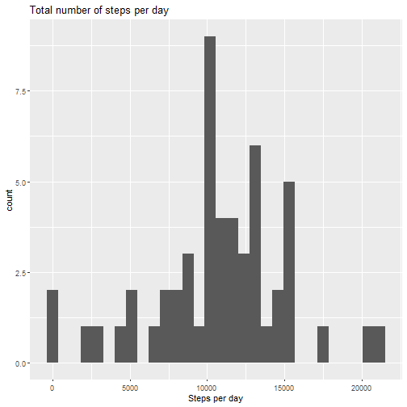
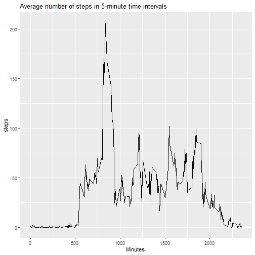
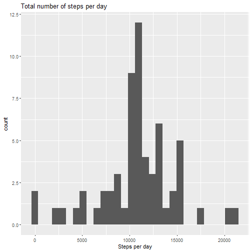
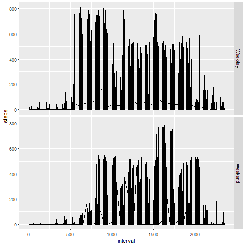

## Loading and preprocessing the data


```r
# Load data and reformat date column from character to date object.
unzip("activity.zip")

data <- read.csv("activity.csv")
data$date <- as.Date(data$date, "%Y-%m-%d", tz = "")
```


## What is mean total number of steps taken per day?

```r
# Calculate sum of steps per day.
steps_sum <- aggregate(steps ~ date, data = data, sum)

# Plot histogram of sum of steps per day.
ggplot(steps_sum, aes(x = steps)) +
        geom_histogram() +
        labs(x = "Steps per day", title = "Total number of steps per day")
```

```
## `stat_bin()` using `bins = 30`. Pick better value with `binwidth`.
```



```r
# Return mean and median of total number of steps per day.
mean(steps_sum$steps)
```

```
## [1] 10766.19
```

```r
median(steps_sum$steps)
```

```
## [1] 10765
```


## What is the average daily activity pattern?

```r
# Find average number of steps taken during each 5 minute interval over the course of the study.
steps_ave <- aggregate(steps ~ interval, data = data, mean)

# Plot average number of steps for each interval.
ggplot(steps_ave, aes(x = interval, y = steps)) +
        geom_line() +
        labs(x = "Minutes", title = "Average number of steps in 5-minute time intervals")
```



```r
# Return the interval with the maximum number of steps on average.
steps_ave[steps_ave$steps == max(steps_ave$steps),]
```

```
##     interval    steps
## 104      835 206.1698
```


## Imputing missing values

```r
# Calculate the total number of missing values in dataset.
length(which(is.na(data)))
```

```
## [1] 2304
```

```r
# Replace missing values for the mean for that 5 minute interval. Return a new data frame (df) with these missing values filled.

mean_int <- data %>%
        group_by(interval) %>%
        summarize(mean_value = mean(steps, na.rm = TRUE))

complete_df <- data %>%
        left_join(mean_int, by = "interval") %>%
        mutate(complete = ifelse(is.na(data$steps), mean_value, data$steps)) %>%
        select(-mean_value)

complete_df %>% 
        subset(select = c(complete, date, interval)) %>%
        rename(steps = complete) ->  df

# Calculate sum of steps per day for the complete data frame.
steps_sum <- aggregate(steps ~ date, data = df, sum)

# Plot histogram of sum of steps per day.
ggplot(steps_sum, aes(x = steps)) +
        geom_histogram() +
        labs(x = "Steps per day", title = "Total number of steps per day")
```

```
## `stat_bin()` using `bins = 30`. Pick better value with `binwidth`.
```



```r
# Return mean and median of total number of steps per day.
mean(steps_sum$steps)
```

```
## [1] 10766.19
```

```r
median(steps_sum$steps)
```

```
## [1] 10766.19
```


## Are there differences in activity patterns between weekdays and weekends?

```r
# Create a data frame with two levels: for weekends and weekdays.
weekends <- c("Saturday", "Sunday")
df$daytype <- ifelse(weekdays(df$date) %in% weekends, "Weekend", "Weekday") 
df$daytype <- factor(df$daytype)

# Panel plot of the 5 minute interval and average number of steps taken, averaged across all weekday or weekend days.
ggplot(df, aes(x = interval, y = steps)) +
        geom_line() +
        facet_grid(daytype ~.)
```



